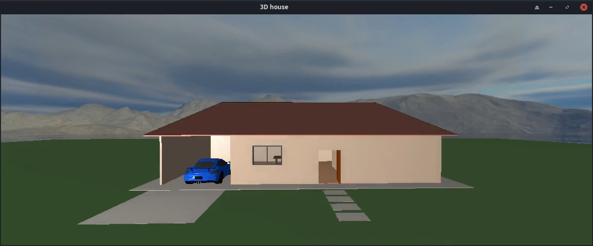

# A 3D House in OpenGL

A simple 3D house implemented with `C` and `OpenGL`.


[](https://user-images.githubusercontent.com/22989734/176726421-5a2d4164-2e08-4445-af40-84ff88918adc.mp4)


# How to run it

```shell
make release
bin/house
```
